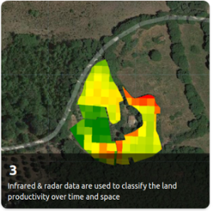
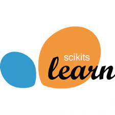
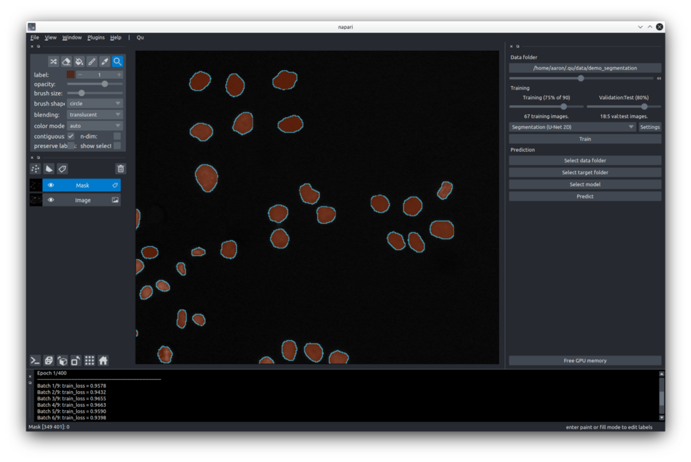
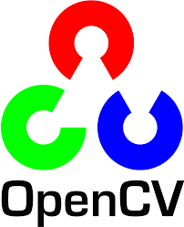
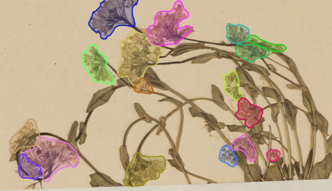

# Hi there 👋

<h1>you are in the repository of dr Matteo Jucker Riva</h1>
   

I am a Geography PhD & data scientist with a global and multidisciplinary background.
I strive to make the world more sustainable and computer models more useful. You can find me on [linkedin](https://www.linkedin.com/in/matteojriva/) and [researchgate 
](https://www.researchgate.net/profile/Matteo_Jucker_Riva). Sometimes I write blogposts on [medium](https://matteo-jriva.medium.com/)

<h1>Here are my technical skills:</h1>

Geodata management and processing: QGIS, ArcGIS, GeoServer, PostGIS

Satellite Image analysis: Google Earth Engine, GRASS, Envi

Programming: Python, R, JavaScript

Data analysis & visualisation: Numpy, Pandas, Plotly, Dash

Machine learning & deep learning: Keras, TensorFlow, PyTorch

<h1>My favorite GIS & remote sensing projects:</h1>

   

<table style="border-color:transaprent" width="30%" href="https://github.com/ciskoh/LandProductivity" >
  <tr>
    <th></th></tr>
    

  <tr>
<a href="https://github.com/ciskoh/LandProductivity" ><h2 style="text-align:left" >Land productivity</h2></a>
    
    
    </tr>
<tr><th>
Near real time tool to to monitor forest and rangeland productivity.

  </tr>
<tr><a href="https://matteojriva.users.earthengine.app/view/suiviedesinterventionsmidelt">Look at the interactive map</a>
    

<table style="border-color:transparent" width="30%" href="https://github.com/ciskoh/climate_hackathon" >
  <tr>
    <th></th></tr>
    

  <tr>
<th ><a href="https://github.com/ciskoh/climate_hackathon" ><h2 style="text-align:left" >LandPro carbon</h2></a>
    </th>
    </th>
    </th>
    </tr>
<tr><th>
AI enhanced CO2 estimation tool for farms, 2nd place at the HacktheClimate 2021

  </tr>
<tr>
    <th><a href="https://devpost.com/software/landpro">See project description</a>
    <a href="https://matteo-jriva.medium.com/our-experience-at-the-hacktheclimate-2021-28ae8e01700d¨">Read blog post</a></th>
    

  

    

<h1>My favorite business analytics projects:</h1>

<table style="border-color:transparent" width="35%" href="https://github.com/ciskoh/migros_branch_optimisation" >
  <tr>
    <th></th></tr>
    

  <tr>
<th ><a href="https://github.com/ciskoh/migros_branch_optimisation" ><h2 style="text-align:left" >Location intelligence</h2></a>
    
    </th>
    </tr>
<tr><th>
Machine learning model to find new locations for supermarkets

  </tr>
<tr>
    <th style="text-align:left"><a href="https://www.google.com/maps/d/u/0/edit?mid=1_uX0U2V-byD1GLv0KRuWC2Gxv2wRuNT7&usp=sharing">Look at the interactive map</a>
    <a href="https://matteo-jriva.medium.com/location-intelligence-the-branch-network-optimization-problem-4aa4740088d8">Read blog post</a></th>
    

<h1>My favorite computer vision projects:</h1>

<table style="border-color:transparent" width="35%" >
  <tr>
    <th></th></tr>
    

  <tr>
<th ><a href="https://github.com/ciskoh/qu" ><h2 style="text-align:left" >Qu</h2></a>
    
    
    </th>
    </tr>
<tr><th>
ML model to segment microscope images for life science research (contributor)   

  </tr>
<tr>
    <a href="https://matteo-jriva.medium.com/on-a-cell-spotting-journey-with-qu-be253b21e6e7">Read blog post</a></th>
    

<table style="border-color:transparent" width="35%"  >
  <tr>
    <th></th></tr>
    

  <tr>
<th ><a href="https://github.com/ciskoh/herbaria--plant-labeling" ><h2 style="text-align:left" >Herbaria</h2></a>
    
    
    </th>
    </tr>
<tr><th>
deep learning model to label herbarium samples

  </tr>
<tr>
    <a href="https://lindseyviann.medium.com/final-bootcamp-blitz-b0e94407b0a">Read blog post</a></th>
    

<h1>My latest NLP projects:</h1>

<table style="border-color:transparent" width="35%"  >
  <tr>
    <th></th></tr>
    

  <tr>
<th ><a href="https://github.com/ciskoh/herbaria--plant-labeling" ><h2 style="text-align:left" >VirtualHerbarium</h2></a>
    
    
    
    </tr>
<tr><th>
web scraper and automatic summarizer to retrieve information about plants (ongoing)

  </tr>
<tr>
    </th>
    

<h1>Things I do for fun:</h1>

<table style="border-color:transparent" width="35%"  >
  <tr>
    <th></th></tr>
    

  <tr>
<th ><a href="https://github.com/ciskoh/mamma-il-covid" ><h2 style="text-align:left" >Mamma il covid</h2></a>
    
    
    
    </tr>
<tr><th>
A dashboard to visualize real-time covid data for my Mum

  </tr>
<tr>
    </th>
    

<table style="border-color:transparent" width="35%"  >
  <tr>
    <th></th></tr>
    

  <tr>
<th ><a href="https://github.com/ciskoh/mamma-il-covid" ><h2 style="text-align:left" >Arduino watering system</h2></a>
    
    </tr>
<tr><th>
Irrigator program for arduino plant based watering systems

  </tr>
<tr>
    </th>
    

