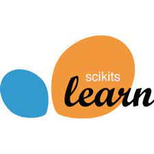
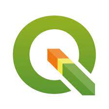

# Hi there 👋

## you are in the repository of dr Matteo Jucker Riva   

I am a Geography PhD & data scientist with a global and multidisciplinary background.
I strive to make the world more sustainable and computer models more useful. You can find me on [linkedin](https://www.linkedin.com/in/matteojriva/) and [researchgate 
](https://www.researchgate.net/profile/Matteo_Jucker_Riva). Sometimes I write blogposts on [medium](https://matteo-jriva.medium.com/)

### Here are my technical skills:

- *Geodata management and processing*: QGIS, ArcGIS, GeoServer, PostGIS
- *Satellite Image analysis*: Google Earth Engine, GRASS, Envi
- *Programming*: Python, R, JavaScript
- *Data analysis & visualisation*: Numpy, Pandas, Plotly, Dash
- *Machine learning & deep learning*: Keras, TensorFlow, PyTorch

## My latest GIS & remote sensing projects:
   

<table width="30%" href="https://github.com/ciskoh/LandProductivity" >
  <tr>
    <th></th></tr>
    

  <tr>
<th ><a href="https://github.com/ciskoh/LandProductivity" ><h2 style="text-align:left" >LandProductivity</h2></a>
    
    </th>
    </tr>
<tr><th>
Near real time tool to to monitor forest and rangeland productivity.

  </tr>
<tr><a href="https://matteojriva.users.earthengine.app/view/suiviedesinterventionsmidelt">Look at the interactive map</a>
    

<table width="30%" href="https://github.com/ciskoh/climate_hackathon" >
  <tr>
    <th></th></tr>
    

  <tr>
<th ><a href="https://github.com/ciskoh/climate_hackathon" ><h2 style="text-align:left" >LandPro_carbon</h2></a>
    </th>
    </th>
    </th>
    </tr>
<tr><th>
AI enhanced CO2 estimation tool for farms, 2nd place at the HacktheClimate 2021

  </tr>
<tr>
    <th><a href="https://devpost.com/software/landpro">See project description</a>
    <a href="https://matteo-jriva.medium.com/our-experience-at-the-hacktheclimate-2021-28ae8e01700d¨">Read blog post</a></th>
    

    
    
## My latest business analytics projects:

<table width="30%" href="https://github.com/ciskoh/migros_branch_optimisation" >
  <tr>
    <th></th></tr>
    

  <tr>
<th ><a href="https://github.com/ciskoh/migros_branch_optimisation" ><h2 style="text-align:left" >Location intelligence</h2></a>
    </th>
    </th>
    </tr>
<tr><th>
machine learning model to find new locations for supermarkets

  </tr>
<tr>
    <th><a href="https://www.google.com/maps/d/u/0/edit?mid=1_uX0U2V-byD1GLv0KRuWC2Gxv2wRuNT7&usp=sharing">Look at the interactive map</a>
    <a href="https://matteo-jriva.medium.com/location-intelligence-the-branch-network-optimization-problem-4aa4740088d8">Read blog post</a></th>
    

## My latest computer vision projects:   
       
- [qu](https://github.com/ciskoh/qu): ML model to segment microscope images for life science research (contributor, ongoing)   
- [herbaria--plant labelling](https://github.com/ciskoh/herbaria--plant-labeling): A deep learning model to label herbarium samples --> [read the blogpost by my colleague Lindsey Viann](https://lindseyviann.medium.com/final-bootcamp-blitz-b0e94407b0a)

## My latest NLP projects:   
      
- [VirtualHerbarium](https://github.com/ciskoh/VirtualHerbarium) a web scraper and automatic summarizer to retrieve information about plants (ongoing)

## Things I do for fun:   
      
- [A dashboard to visualize covid data for my Mum](https://github.com/ciskoh/mamma-il-covid)   
- [An irrigator program for arduino plant based watering systems](https://github.com/ciskoh/irrigator_v2)   

