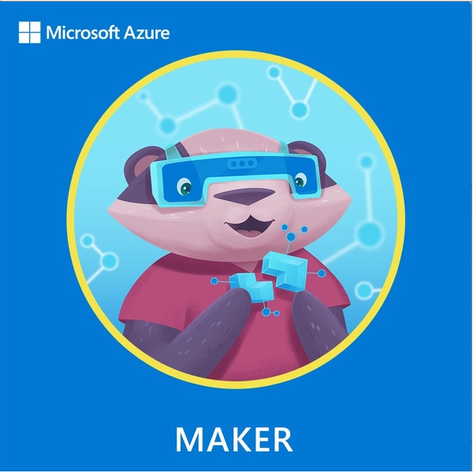

# Hi there 👋

## you are in the repository of dr Matteo Jucker Riva   

I am a Geography PhD & data scientist with a global and multidisciplinary background.
I strive to make the world more sustainable and computer models more useful. You can find me on [linkedin](https://www.linkedin.com/in/matteojriva/) and [researchgate 
](https://www.researchgate.net/profile/Matteo_Jucker_Riva). Sometimes I write blogposts on [medium](https://matteo-jriva.medium.com/)

### Here are my technical skills:

- *Geodata management and processing*: QGIS, ArcGIS, GeoServer, PostGIS
- *Satellite Image analysis*: Google Earth Engine, GRASS, Envi
- *Programming*: Python, R, JavaScript
- *Data analysis & visualisation*: Numpy, Pandas, Plotly, Dash
- *Machine learning & deep learning*: Keras, TensorFlow, PyTorch

## My favorite GIS & remote sensing projects:

- [LandPro](https://github.com/ciskoh/LandProductivity):  Near real time tool to to monitor forest and rangeland management-->[look at the interactive map](https://matteojriva.users.earthengine.app/view/suiviedesinterventionsmidelt)    
- [LandPro carbon:](https://github.com/ciskoh/climate_hackathon) AI enhanced CO2 estimation tool for farms, 2nd place at the HacktheClimate 2021 -->[see project description](https://devpost.com/software/landpro) [see medium post](https://matteo-jriva.medium.com/our-experience-at-the-hacktheclimate-2021-28ae8e01700d)   

## My favorite business analytics projects:
 
- [Location intelligence](https://github.com/ciskoh/migros_branch_optimisation):
Machine learning model to find new locations for supermarkets -->[read the blogpost](https://matteo-jriva.medium.com/location-intelligence-the-branch-network-optimization-problem-4aa4740088d8); [look at the interactive map](https://www.google.com/maps/d/u/0/edit?mid=1_uX0U2V-byD1GLv0KRuWC2Gxv2wRuNT7&usp=sharing)

## My favorite computer vision projects:   

-  [qu](https://github.com/ciskoh/qu): ML model to segment microscope images for life science research (contributor)-->[read the blogpost](https://matteo-jriva.medium.com/on-a-cell-spotting-journey-with-qu-be253b21e6e7)   
- [herbaria--plant labelling](https://github.com/ciskoh/herbaria--plant-labeling): A deep learning model to classify herbarium samples -->[read the blogpost by my colleague Lindsey Viann](https://lindseyviann.medium.com/final-bootcamp-blitz-b0e94407b0a)

## Things I do for fun:   

- [Mamma il covid](https://github.com/ciskoh/mamma-il-covid): A dashboard to visualize covid data for my Mum -->[DEPLOYED on heroku](https://covid-data-for-mums.herokuapp.com/)
-   [Irrigator](https://github.com/ciskoh/irrigator_v2): A timekeeping program for an arduino plant watering systems

